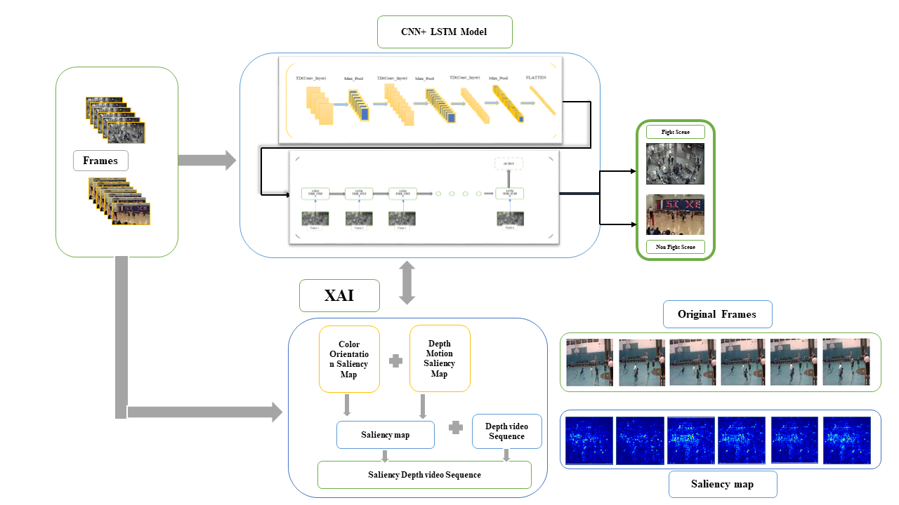

# Violence-s-Recognition

# Violence Recognition using Swin Transformer and CNN-LSTM Models

This project aims to recognize violence in video sequences using state-of-the-art deep learning models: Swin Transformer and CNN-LSTM. We explore both models for their performance in identifying violent actions and utilize Grad-CAM for model explainability.

## Table of Contents

- [Introduction](#introduction)
- [Models Used](#models-used)
  - [Swin Transformer](#swin-transformer)
  - [CNN-LSTM](#cnn-lstm)
- [Dataset](#dataset)
- [Methodology](#methodology)
- [Results](#results)
- [Explainability with Grad-CAM](#explainability-with-grad-cam)
- [Conclusion](#conclusion)
- [References](#references)

## Introduction

The objective of this project is to develop an efficient and accurate system for violence detection in videos. We employ two advanced deep learning architectures, Swin Transformer and CNN-LSTM, to tackle this challenge. Violence recognition is crucial for applications in public safety, surveillance systems, and content moderation.

## Models Used

### Swin Transformer

The Swin Transformer is a hierarchical vision transformer that has shown outstanding performance in various vision tasks. Its ability to model long-range dependencies while maintaining computational efficiency makes it suitable for video-based applications.

- **Architecture:** The Swin Transformer employs a shifted window approach, which efficiently captures local and global features.
- **Performance:** In our experiments, the Swin Transformer achieved better accuracy compared to the CNN-LSTM model.

### CNN-LSTM

The CNN-LSTM model combines convolutional neural networks (CNN) for feature extraction and long short-term memory (LSTM) networks for sequence modeling. This hybrid architecture is well-suited for analyzing temporal sequences in video data.

- **Architecture:** TimeDistributed CNN layers are followed by LSTM units to capture spatial and temporal information from video frames.
- **Use Case:** Though slightly less accurate than the Swin Transformer, CNN-LSTM provides valuable insights into sequence modeling.

## Dataset

The dataset used for this project consists of annotated video clips depicting both violent and non-violent actions. The data was pre-processed to extract frames and organize them into sequences suitable for training the models.

## Methodology

1. **Data Pre-processing:**
   - Video frames were extracted and resized for consistency.
   - Frames were organized into sequences for input into the models.

2. **Model Training:**
   - Both the Swin Transformer and CNN-LSTM models were trained using a split of the dataset, with hyperparameter tuning to optimize performance.

3. **Evaluation:**
   - Model performance was evaluated using accuracy, precision, recall, and F1-score metrics.

## Results

- **Swin Transformer:**
  - Achieved superior accuracy and generalization capability.
  - Demonstrated robust performance across various scenarios.

- **CNN-LSTM:**
  - Provided competitive results with slightly lower accuracy than the Swin Transformer.
  - Effective in modeling temporal dependencies in video data.

## Explainability with Grad-CAM

To interpret model predictions, we used Grad-CAM (Gradient-weighted Class Activation Mapping) to visualize the regions of video frames that influenced the models' decisions.

- **Grad-CAM for Swin Transformer:**
  - Highlighted important spatial regions within frames contributing to violence detection.

- **Grad-CAM for CNN-LSTM:**
  - Showed temporal patterns and key frame areas crucial for recognizing violent actions.

## Conclusion

The Swin Transformer outperformed the CNN-LSTM model in accuracy for violence recognition tasks, offering a powerful solution for video-based violence detection. Grad-CAM provided valuable insights into model decision-making, enhancing transparency and trust in the model outputs.

## References

- [Swin Transformer Paper](https://arxiv.org/abs/2103.14030)
- [CNN-LSTM Paper](https://arxiv.org/abs/1506.04214)
- [Grad-CAM Paper](https://arxiv.org/abs/1610.02391)

